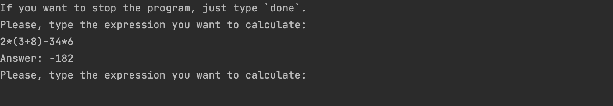

# Проект Simple calculator

### Описание проекта
Проект содержит реализацию `simple calculator`, который может вычислять
выражения со следующими операторами:
+ `+`
+ `-`
+ `*`
+ `/`
+ `^`

Также он корректно обрабатывает унарный минус и выражения с использованием скобок.

------------
### Использование

Для запуска рекомендуется использовать **python3.9**, а также понадобится **git**.

Калькулятор является очень простой программой и не требует установки дополнительных пакетов.

Чтобы протестировать работу, нужно выполнить следующие команды в консоли:

```commandline
git clone git@github.com:alexandraizhevskaya/project_simple_calculator.git
cd project_simple_calculator
python main.py
```

После запуска программы в командной строке вы увидите следующее сообщение:

Далее нужно будет ввести выражение, которое Вы хотите вычислить, желательно без пробелов.

Пример:

`2*(3+8)-34*6`

Однако на всякий случай реализовано удаление лишних пробелов в выражении, поэтому выражение вида: 

`2 * (3 + 8) - 34 * 6`

также будет обработано корректно.

После будет выведен результат вычисления выражения:




Вы можете вводить сколько угодно выражений, а когда захотите завершить работу программы, 
просто введите `done`, как указано в инструкции.

----------------
### Структура репозитория
* `calculator_class.py` - файл с классом `SimpleCalculator`, в методе которого `process_calculation_query` реализована логика вычислений
* `main.py` - скрипт, запускающий функцию `run_calculation` из консоли
* `test_calculator` - юнит-тесты (вычисления выражений для проверки корректности)
* `pictures` - папка со скриншотами для иллюстрации работы программы

------------
### Ограничения 

Данная реализация является базовой и поддерживает лишь ограниченный набор операций, указанных выше.
Остальные операции не поддерживаются и не будут обработаны, о чем будет сообщено в консоли.

----------------
### Особенности реализации

Алгоритм состоит из 3 основных шагов, соответствующих 
отдельным методам класса `SimpleCalculator`
+ распарсить поданную на вход строку
+ перевести выражение в обратную польскую нотацию с помощью алгоритма сортировочной станции
+ вычислить полученное выражение

Кроме того, был добавлен дополнительный шаг: валидация поданной на вход строки.
Сначала удаляются лишние пробелы, если они вдруг закрались в выражение - опечататься легко. 
А затем строка проверяется с помощью простого регулярного выражения на то, что содержит только допустимые символы - 
цифры и операторы, которые реализованы.

Если это не так, то программа сразу выдает ошибку вида:

```
WARNING:root:Sorry, the given expression cannot be calculated
WARNING:root:You provided an incorrect input.
The allowed symbols are: digits: 0-9, operators: `+-*\^` and brackets: `()`
```

Кроме того, при попытке поделить на 0 также появится сообщение об ошибке:
```
WARNING:root:Sorry, the given expression cannot be calculated
WARNING:root:Zero division is not possible!
```

Сама же программа работать не перестанет, и пользователь сможет сразу
же исправить свою ошибку, введя повторно исправленное выражение.


